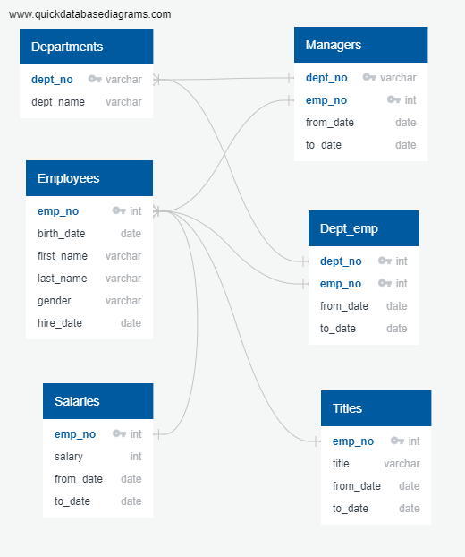
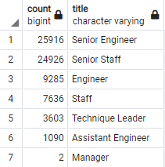

# Pewlett-Hackard-Analysis
## Overview
Pewlett-Hackard is a large company who would like to answer questions about their retiring workforce. Using SQL, the report will attempt to answer questions regarding the "silver tsumani". This is referring to a large number of employees who are approaching retirment and their positions need to be filled. The analysis will include queries run regarding which employees are retiring, departments they come from, and staff who can help mentor the next generation. Lastly, we will summarize our findings by looking into the future state of the company.

## Resources
#### Software:
- PgAdmin 4 6.8
- PostgreSQL 11.16
- Visual Studio Code 1.69.2
- [quickdatabasediagrams.com](https://www.quickdatabasediagrams.com)

#### Data: 
- [departments.csv](Data/departments.csv)
- [dept_emp.csv](Data/dept_emp.csv), 
- [dept_manager.csv](Data/dept_manager.csv)
- [employees.csv](Data/employees.csv)
- [salaries.csv](Data/salaries.csv)
- [titles.csv](Data/titles.csv)

## Relational Database Diagram
Entity Relationship Diagram (ERD) for Pewlett-Hackard workforce:



## Results
During the data organization, I queried all employees retiring(between 62 and 65 years old) and their titles as well as employees who are mentorship eligible (55 years old) and their titles. The below figure shows all retiring employees by their department.


> Figure 1

Using the aforementioned queries, I came up with four major points:

1. The majority of people retiring are senior staff. Over 25,000 senior engineers and nearly 25,000 senior staff. These need to be replaced by either promoting current staff members of hiring new staff that are senior level.
2. Two of the nine department managers need to be replaced. There are only nine departments, so seeing two managers on the brink of retirement means that 22.2% of all managers will be retiring soon. Replacing managers carefully and appropriately will be important to the future success of Pewlett-Hackard.
3. When adding up all the numbers of retiring staff, 72,458 total people fit that category. This is a huge number of staff. Seeing as this is three years away, a plan needs to be in place soon to handle this. 
4. Based on mentorship eligibility, only 1,549 total people are eligible who can mentor new staff. We might need a larger group of people who can be mentors in order to train enough new staff to fill the 72,458 upcoming vacancies if Pewlett-Hackard is to remain with a similarly sized workforce.


## Summary
### How the Silver Tsunami Affects the Future
The silver tsumani at Pewlett-Hackard refers to the large group of employees who are about to retire. As seen in the results, over the next 3 years there will be 72,458 people retiring. This is a staggering number. Especially when it is taken in relation to the mentorship eligible employees. There are only 1,549 employees able to mentorship. This means that in order to train all the replacements, one mentor would have to have nearly 47 mentees over the course of the "tsunami". Pewlett-Hackard needs to figure out more ways to train employees other than the mentorship eligible ones.

### Other Queries
Lastly using SQL, I will discuss other queries we can run. 

In order to be as effective as possible in the mentorship program, we can count the eligible staff by department. This is similar to retiring staff by department. Some departments might have a more mentor eligible staff to replace the retiring employees.
```
SELECT COUNT(title), title
FROM mentorship_eligibility
GROUP BY title
ORDER BY COUNT(title) DESC;
```

Another important query are the salaries. We can run the below query to get all retiring employees based on their salary. By creating a new SQL table with salaries we can see the monetary value of all the retiring employees and even break that down by department. The bottom line of a company is their profit, so analysis on salary data is extremely important for the success of Pewlett-Hackard.
```
SELECT DISTINCT ON (e.emp_no) e.emp_no, e.first_name, e.last_name, s.salary
FROM employees as e
INNER JOIN salaries as s
ON (e.emp_no = s.emp_no)
WHERE (e.birth_date BETWEEN '1952-01-01' AND '1955-12-31')
ORDER BY e.emp_no, s.to_date DESC;
```